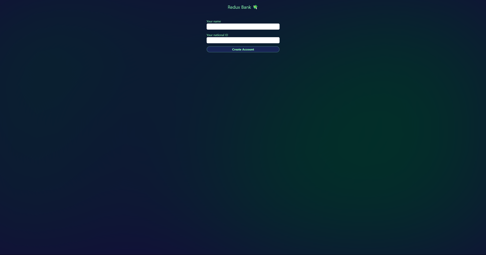
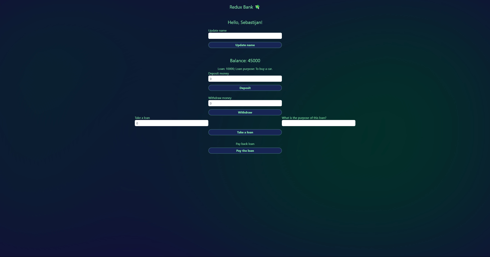

# Simple Redux Bank

A minimal demo banking app built with React, TypeScript, Vite and Redux Toolkit. This repository demonstrates a small, well-structured example of client-side state management (customers and accounts) using modern tooling and best practices.

## Table of Contents

- [Overview](#overview)
- [Features](#features)
- [Tech Stack](#tech-stack)
- [Installation](#installation)
- [Project Structure](#project-structure)
- [Scripts](#scripts)
- [Screenshots](#screenshots)
- [License](#license)

## Overview

- Lightweight learning project to practice Redux Toolkit patterns with TypeScript and Vite.
- Clean, component-driven structure suitable as a starter or teaching example.

---

## Features

- Create and manage customers.
- Create and manage accounts tied to customers (deposit, withdraw, request/pay loan).
- Uses Redux Toolkit slices and selectors for predictable state updates.
- TypeScript for safer refactoring and better developer experience.

---

## Tech Stack

- React 18
- TypeScript
- Vite (bundler & dev server)
- Redux Toolkit (slices + store)
- Tailwind CSS (styling)

---

## Installation

Prerequisites: Node.js (16+ recommended) and a package manager (`npm`, `pnpm`, or `yarn`).

1. Clone the repo

```powershell
git clone https://github.com/Sebastijan-Dominis/simple-redux-bank.git
cd simple-redux-bank
```

2. Install dependencies

```powershell
npm install
```

3. Run the development server

```powershell
npm run dev
# then open http://localhost:5173 (or the URL shown in the terminal)
```

4. Build for production

```powershell
npm run build
npm run preview
```

---

## Project Structure

- `src/main.tsx` — app entry and React DOM mounting.
- `src/App.tsx` — top-level app component and layout.
- `src/store.ts` — Redux store configuration (combine slices here).
- `src/features/customers/customerSlice.tsx` — customer slice (actions, reducers, selectors).
- `src/features/accounts/accountSlice.tsx` — account slice.
- `src/components` — UI components (inputs, header, buttons).

This structure keeps features grouped, making it easy to scale and reason about state and UI together.

---

## Scripts

- `npm run dev` — start Vite dev server.
- `npm run build` — build production bundle.
- `npm run preview` — locally preview the production build.
- `npm run lint` — run ESLint across the project.

---

## Screenshots





## License

- See the `LICENSE` file included in this repository.

**Contributing**

- Contributions are welcome. Open an issue or send a PR with a clear description of the change.

**Contact / Author**

- Author: repository owner (see repository metadata)
